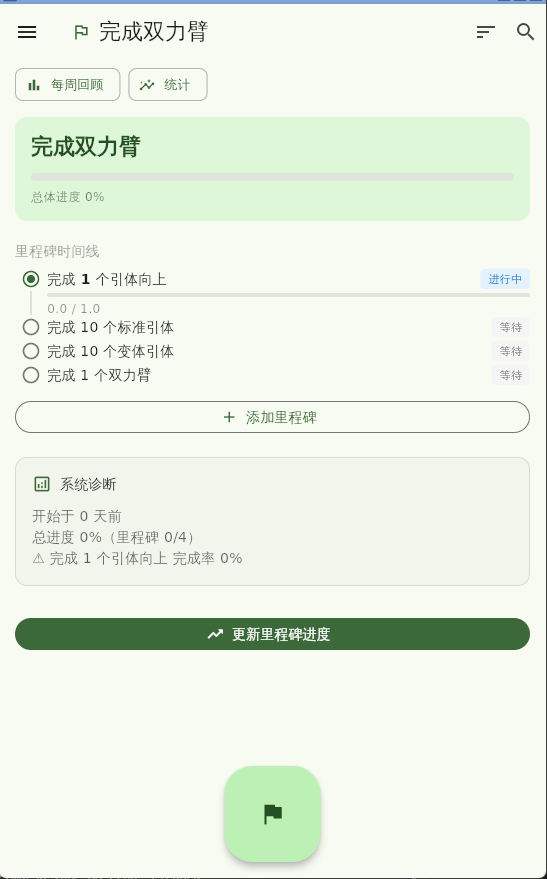
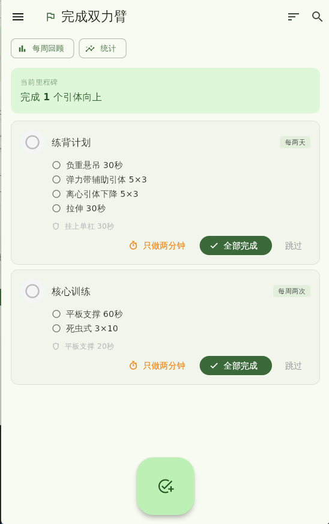
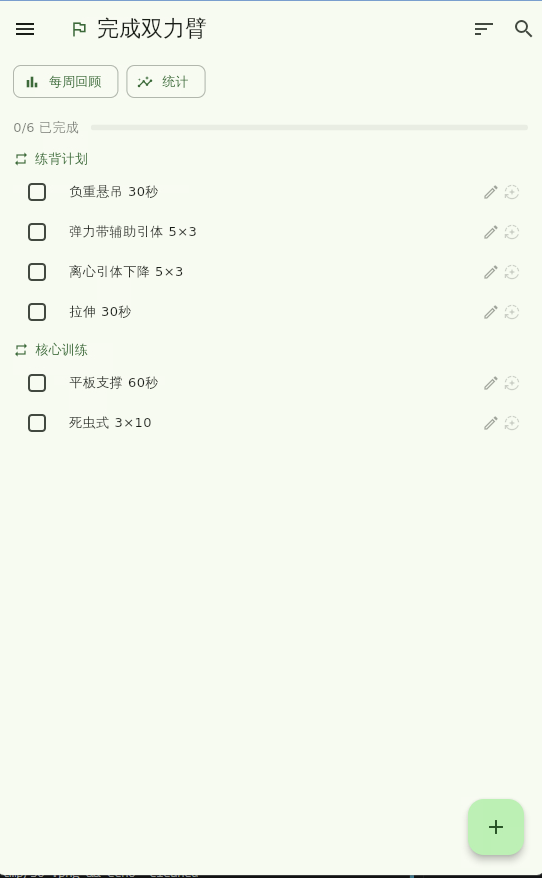
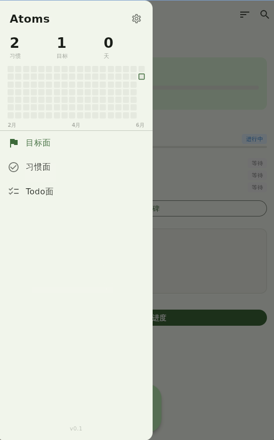
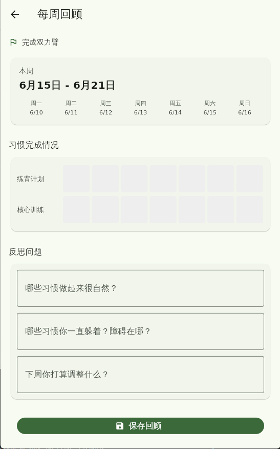

# atoms-habits

基于原子习惯理论的习惯追踪应用，Flutter + SQLite 实现。

## 设计理念

每个习惯由不可拆分的**行动项（Atom）**构成。完成所有行动项即完成习惯。身份不是一次达成的，而是由一次次有意识的完成堆叠而成。

## 截图

| 目标详情 | 习惯面 | Todo 面 |
|--------|--------|---------|
|  |  |  |

| 抽屉菜单 | 每周回顾 |
|--------|--------|
|  |  |

## 功能

- **习惯打卡**：三态完成（完整版 / 两分钟版 / 跳过）
- **行动项拆分**：每个习惯可配置多个具体动作，独立勾选
- **Todo 自动生成**：训练日自动生成待办，手动/自动同步
- **抽屉热力图**：18 周 GitHub 风格贡献图
- **里程碑推进**：目标 → 里程碑 → 习惯 → 行动项，层层递进
- **每周回顾**：自定义反思问题 + 历史回顾
- **身份洞察**：累计打卡触发身份浮现，"我是一个爱运动的人"
- **CLI 控制**：TCP 命令行接口，支持自动化测试

## 技术栈

| 层 | 技术 |
|---|------|
| UI | Flutter 3.44 + Material 3 |
| 状态管理 | Riverpod（MVVM） |
| 数据库 | SQLite（sqflite） |
| 图表 | fl_chart |
| CLI | 自定义 TCP JSON-line 协议 |
| 架构 | 组件化 + Provider 驱动 |

## 项目结构

```
lib/
├── components/        # 可复用 UI 组件（12 个）
├── pages/             # 页面（View + ViewModel 绑定）
├── providers/         # Riverpod Provider（ViewModel）
├── services/          # 业务逻辑层（Model）
├── models/            # 数据模型
├── modules/           # 基础设施（数据库、CLI）
├── app.dart           # App 入口配置
└── main.dart          # 启动入口
```

## 快速开始

```bash
# 编译 debug 版本
flutter build linux --debug

# 启动应用
./scripts/start_atoms.sh

# 运行集成测试
cd workflow && python3 run_all.py
```

## 相关仓库

| 仓库 | 说明 |
|------|------|
| [cli_bridge](https://github.com/chlmm/cli_bridge) | TCP CLI 通用框架 |
| [sqlite_migrator](https://github.com/chlmm/sqlite_migrator) | SQLite 版本迁移工具 |
